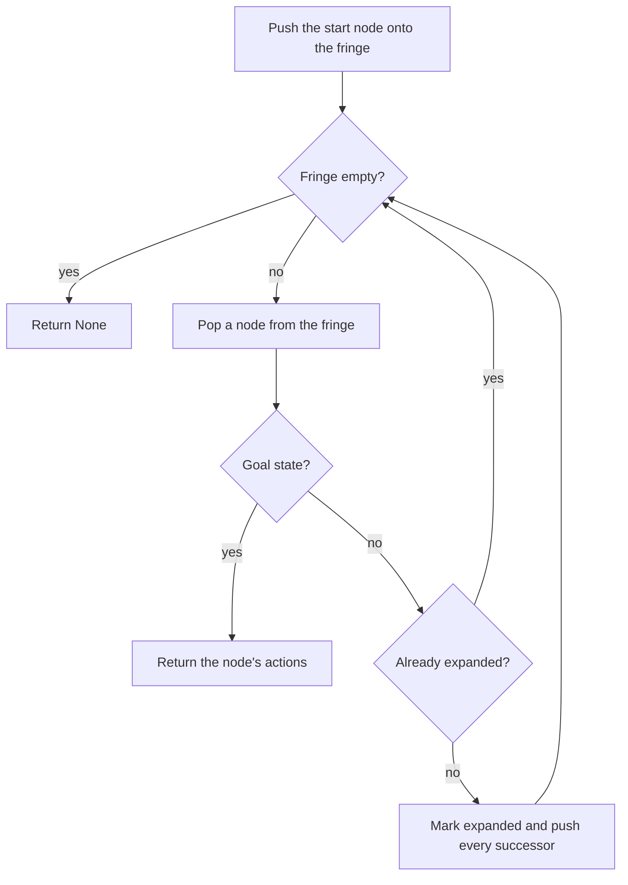

# 🧩 Escape the Maze: Classical AI Search

Seven classical search algorithms (DFS, BFS, DLS, IDS, UCS, Greedy best-first and A\*) that help the Runners of *The Maze Runner* find their way out of the Maze, through walls, thick ivy and Griever territory. A final challenge asks Thomas to collect six pieces of the escape code before he is allowed through the Griever Hole.

Mini Project 01 for **Artificial Intelligence**, Information Technology University.

---

## 📑 Table of Contents

1. [Overview](#-overview)
2. [Features](#-features)
3. [Project Structure](#-project-structure)
4. [Getting Started](#-getting-started)
5. [Usage](#-usage)
6. [The Maze](#-the-maze)
7. [Algorithms at a Glance](#-algorithms-at-a-glance)
8. [Implementation Notes](#-implementation-notes)
9. [The Key Hunt Problem](#-the-key-hunt-problem)
10. [Results](#-results)
11. [Troubleshooting](#-troubleshooting)
12. [Authors](#-authors)
13. [Academic Integrity](#-academic-integrity)

---

## 📌 Overview

You wake up in the Glade, a grassy square surrounded by stone walls. Every morning the walls open onto the Maze, and every night the Grievers come out. The Runners have mapped corridors by hand for three years without finding the exit.

This project replaces manual exploration with search. Every algorithm talks to the maze only through a small `SearchProblem` interface:

```text
getStartState()          the starting state
isGoalState(state)       True / False
getSuccessors(state)     [(nextState, action, stepCost), ...]
getCostOfActions(acts)   total cost of a list of actions
```

Because the algorithms never touch the maze directly, the **same** code solves ordinary mazes and the key-collection problem, whose states are not just positions.

## ✨ Features

- **Seven search algorithms** written as general-purpose graph searches
- **Weighted terrain:** corridors, thick ivy and Griever territory cost different amounts
- **Problem formulation:** a key-collection problem with a compact, hashable state
- **Custom heuristics:** Manhattan, Euclidean, and a consistent heuristic for the key hunt
- **Visual runner:** animated windows, text mode and a numbers-only mode
- **`--compare` mode:** one table comparing every algorithm on a maze

## 📁 Project Structure

```text
maze_runner/
├── search.py          # DFS, BFS, DLS, IDS, UCS, Greedy, A*
├── heuristics.py      # Manhattan and Euclidean heuristics
├── griever_hole.py    # Key-hunt problem and its heuristic
├── problems.py        # SearchProblem interface, MazeProblem, GraphProblem, mazeDistance
├── util.py            # Stack, Queue, PriorityQueue, CUTOFF
├── maze.py            # Maze loading, terrain costs, neighbour order
├── runner.py          # Command-line program
├── display.py         # Text and graphical displays
└── mazes/             # Maze layouts
```

| File | Role |
|---|---|
| `search.py` | The algorithms. Everything else supports these. |
| `heuristics.py` | Distance estimates used by Greedy and A\*. |
| `griever_hole.py` | `KeyHuntProblem` (states, goal, successors) and `keyHuntHeuristic`. |
| `problems.py`, `util.py`, `maze.py` | Provided infrastructure, read-only for this project. |
| `runner.py`, `display.py` | Running and visualizing a search. |

## 🚀 Getting Started

**Requirements**

- Python 3.8 or newer
- Tkinter (optional, for the graphical window)

Everything else comes from the Python standard library.

```bash
git clone <repository-url>
cd <repository-folder>/maze_runner
python runner.py
```

If no window opens, add `-t` for text output. On Linux, `sudo apt install python3-tk` adds Tkinter.

## 🕹️ Usage

```bash
python runner.py -l <maze> -a <algorithm> [options]
```

| Option | Meaning |
|---|---|
| `-l` | Maze name (see `--list`) |
| `-a` | Algorithm: `dfs`, `bfs`, `dls`, `ids`, `ucs`, `gbfs`, `astar`, `right` |
| `-d` | Depth limit for DLS |
| `-H` | Heuristic: `manhattan`, `euclidean`, `keyhunt`, `null` |
| `-p keys` | Use the key-hunt problem instead of a plain maze |
| `-t` | Text output, no window |
| `-q` | Numbers only |
| `--compare` | Table of every algorithm on one maze |
| `--timeout` | Give up after N seconds (default 60) |
| `--list` | List all mazes |

**Examples**

```bash
python runner.py -l maze_small -a dfs                       # depth-first
python runner.py -l maze_medium -a bfs                      # breadth-first
python runner.py -l maze_small -a dls -d 60                 # depth-limited
python runner.py -l maze_small -a ids                       # iterative deepening
python runner.py -l griever_alley -a ucs                    # uniform-cost
python runner.py -l greedy_trap -a gbfs -H manhattan        # greedy
python runner.py -l maze_big -a astar -H manhattan          # A*
python runner.py -l keys_small -p keys -a bfs               # key hunt with BFS
python runner.py -l keys_medium -p keys -a astar -H keyhunt # key hunt with A*
python runner.py -l ivy_maze --compare                      # compare everything
```

In the window, expanded cells are shaded from light yellow (early) to deep orange (late), and the runner follows the returned path. Press **Space** to skip the animation and **Q** to close.

## 🗺️ The Maze

| Symbol | Meaning | Cost to enter |
|:---:|---|:---:|
| `%` | Wall | impassable |
| ` ` | Corridor | 1 |
| `S` | The Glade door (start) | 1 |
| `E` | The exit / Griever Hole | 1 |
| `~` | Thick ivy | 3 |
| `G` | Griever territory | 10 |
| `K` | A piece of the escape code | 1 |

Positions are `(row, col)` with row 0 at the top. The actions are `North`, `South`, `East` and `West`, and a move costs the terrain cost of the cell stepped **into**.

Available mazes: `maze_tiny`, `maze_small`, `maze_medium`, `maze_big`, `open_glade`, `ivy_maze`, `griever_alley`, `greedy_trap`, `keys_tiny`, `keys_small`, `keys_medium`.

## 🧠 Algorithms at a Glance

DFS, BFS, UCS, Greedy and A\* are the **same graph-search loop**. They differ only in the fringe container and the priority that orders it.



| Algorithm | Fringe | Orders nodes by | Complete | Optimal |
|---|---|---|:---:|---|
| **DFS** | Stack (LIFO) | most recent first | yes (finite graph) | no |
| **BFS** | Queue (FIFO) | fewest steps | yes | fewest **steps** (cheapest only if every step costs the same) |
| **DLS** | Stack, with a depth limit | most recent first | only if limit ≥ solution depth | no |
| **IDS** | repeated DLS, limit 0, 1, 2, … | fewest steps | yes | fewest **steps** |
| **UCS** | Priority queue | path cost g(n) | yes | **cheapest** path |
| **Greedy** | Priority queue | heuristic h(n) | yes (finite graph) | no |
| **A\*** | Priority queue | g(n) + h(n) | yes | **cheapest** path with a consistent heuristic |

**What each choice buys you**

- **BFS vs UCS:** BFS minimizes steps, UCS minimizes cost. On `griever_alley`, BFS walks straight through Griever territory (20 steps, cost 56), while UCS detours around it (28 steps, cost 42).
- **Greedy vs A\*:** Greedy runs toward the exit and can be lured into expensive terrain. A\* adds the cost already paid and fixes this, while still expanding far fewer nodes than UCS.
- **DLS vs IDS:** DLS needs a limit that you must guess. IDS tries limits 0, 1, 2, … and returns BFS-quality paths using DFS-like memory, at the price of re-expanding shallow nodes.

## 🔧 Implementation Notes

The rules every algorithm follows:

- Return a list of actions from start to goal (`[]` if the start is already a goal), or `None` if there is no solution. DLS may also return `CUTOFF`.
- Call `getSuccessors(state)` **exactly once** per expanded state.
- Push successors in the order `getSuccessors` returns them.
- **Goal-test when a state is popped**, not when it is generated.
- DFS, BFS, UCS, Greedy and A\* are **graph searches**: keep a set of expanded states and mark a state as expanded when it is popped.

**Depth-Limited Search is different.** A global explored set can hide a route that fits the depth limit. Consider A→B, A→C, B→C, C→D, D→G with limit 3: if C is marked explored after the A→B→C route (depth 2), the route A→C→D→G (exactly 3 steps) is never tried. DLS therefore only avoids states **on the current path**, and it returns three distinct outcomes:

| Return value | Meaning |
|---|---|
| a list of actions | a goal was found within the limit |
| `CUTOFF` | no goal found, but the limit stopped the search somewhere |
| `None` | no goal found and the limit was never reached, so no solution exists |

## 🔑 The Key Hunt Problem

The exit is the **Griever Hole**, and it only opens once Thomas has stepped on **every** escape-code piece (`K`), in any order.

**State representation.** A position alone is not enough, so a state is a tuple:

```text
state = ( (row, col),  frozenset of pieces NOT yet collected )
```

- **Hashable:** tuples and frozensets can go into the `expanded` set.
- **Position first:** `state[0]` is Thomas's `(row, col)`.
- **Small:** the *order* of pickup does not affect the future, so a frozenset is enough. With six pieces there are 64 possible subsets, but 1957 possible pickup sequences.
- **Goal:** Thomas is on the exit **and** no pieces remain.

**Heuristic.** `keyHuntHeuristic` estimates the remaining cost as:

```text
h = (distance to the nearest target) + (weight of a minimum spanning tree over the targets)
```

where the targets are the remaining pieces plus the exit, and distances come from `mazeDistance` (true step counts, walls included).

- **Admissible:** any walk that visits every target connects them all, so it costs at least as much as the spanning tree, and steps never exceed the true cost.
- **Consistent:** distances change by at most one step per move. Picking up a piece raises the tree weight by at most the distance to its nearest neighbour, which is exactly the new nearest-target term. At the goal, h = 0.
- The tree depends only on which pieces remain, so it is cached per remaining set.

## 📊 Results

Reference values from the project specification. Path cost and steps must match for the optimal algorithms (BFS, IDS, UCS, A\*). For DFS and Greedy, any legal path is correct, and node counts can differ slightly with the push order.

| Algorithm | Maze | Path cost | Steps | Nodes expanded |
|---|---|---:|---:|---:|
| DFS | `maze_small` | 50 | 50 | 82 |
| DFS | `maze_medium` | 162 | 162 | 233 |
| BFS | `maze_tiny` | 8 | 8 | 27 |
| BFS | `maze_medium` | 66 | 66 | 407 |
| BFS | `open_glade` | 32 | 32 | 344 |
| DLS (limit 60) | `maze_small` | 50 | 50 | 52 |
| DLS (limit 30) | `maze_small` | CUTOFF | – | 32 |
| IDS | `maze_small` | 50 | 50 | 1352 |
| UCS | `griever_alley` | 42 | 28 | 50 |
| UCS | `ivy_maze` | 70 | 64 | 418 |
| Greedy | `greedy_trap` | 52 | 25 | 60 |
| Greedy | `maze_medium` | 80 | 80 | 81 |
| A\* | `greedy_trap` | 25 | 25 | 155 |
| A\* | `maze_big` | 124 | 124 | 679 |
| BFS (key hunt) | `keys_tiny` | 26 | 26 | 490 |
| BFS (key hunt) | `keys_small` | 54 | 54 | 1723 |

**Key hunt on `keys_medium`**

| Algorithm | Path cost | Nodes expanded |
|---|---:|---:|
| UCS (baseline) | 94 | 9695 |
| A\* with `keyHuntHeuristic` | 94 | 497 |

Both find the optimal cost of 94. The heuristic cuts the work by about 95%.

**Greedy vs A\* on `greedy_trap`:** Greedy expands 60 nodes but returns a cost-52 path. A\* expands 155 and returns the cost-25 path.

To reproduce any row:

```bash
python runner.py -l <maze> -a <algorithm> -q
```

## 🩺 Troubleshooting

| Problem | Fix |
|---|---|
| Window does not open / "no display" | Add `-t` for text output. On Linux: `sudo apt install python3-tk`. |
| `RecursionError` in DLS / IDS | The runner raises the recursion limit to 20,000. If you call your code elsewhere, set it yourself, or use an explicit stack instead of recursion. |
| Numbers do not match | Check the rules: goal-test on pop, push successors in the given order, mark states expanded on pop, call `getSuccessors` only when expanding. Then test on a tiny graph you can solve by hand. |
| A search hangs | Usually a state is being re-expanded. Check the explored set. The runner stops after 60 seconds (`--timeout`). |
| IDS is very slow on `open_glade` | Expected. A wide, open maze makes IDS repeat a huge amount of work. |


## 🎓 Academic Integrity

This repository is coursework for *Artificial Intelligence* at Information Technology University. Submissions are checked for similarity against other students' work and online solutions. If you are taking this course, write your own implementation and use this README only to understand the ideas.

---

_Inspired by James Dashner's *The Maze Runner*._
